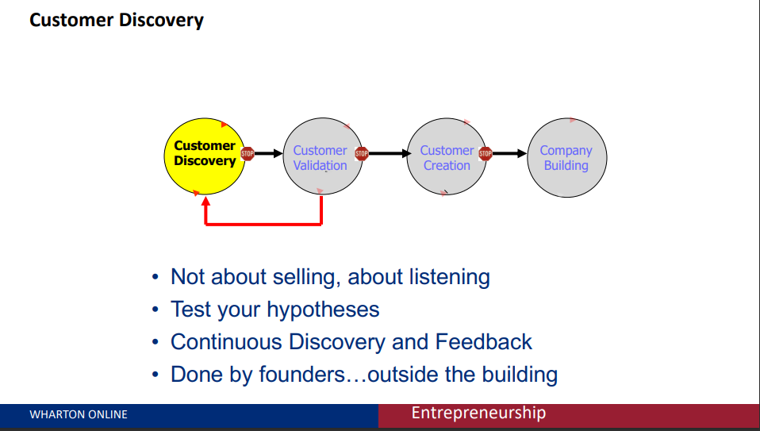

--- 
title: the product, the pitch, and when is quiting your jobs is a good idea. 
sidebar: auto
--- 
# key question 
1. How can I get market feedback most efficiently? 
2. What happens if the initial approach doesn't work? 
3. When should I quit my jobs? 
4. How di I convince other the value of the opportunity? 
5. How do I form a team? 
6. How do we allocate equity among the teams members? 
7. How do I find and retain service providers, 8. advisors, and other partners? 
8. How do I name my company and product? 
9. When and how do I form separate legal entity? 
10. How do I prevent others from copying me? 

## The Lean Methodology

### product introduction model 
The product introduction model is a simple way to think about the process of launching a new product. 

### Customer Discovery Method. 

The customer discovery method is really on of the key to this idea lean start up. it means, that instead of going out and telling people about what they want, you go out and ask them what they want. 

the Customer Discovery Method is a process for finding out what customers want. if people are willing to spend money on your product, then you have a market-fit product. a